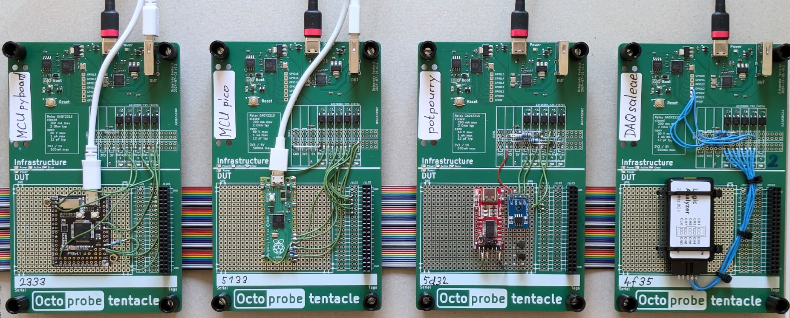
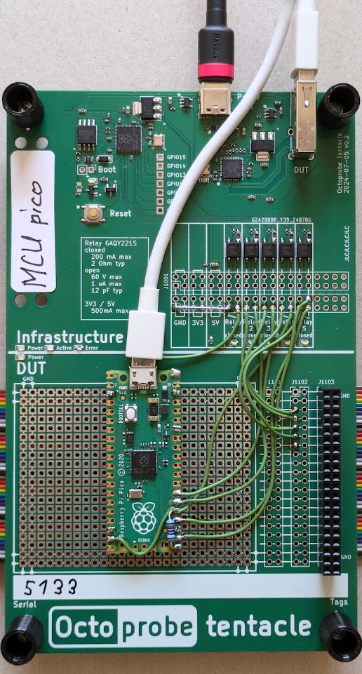

# HIL (Hardware in the Loop) testinfrastructure

[Presentation at MicroPython Meetup Melbourne](README_images/2024-07-27_melbourne_micropython_meetup.pdf)

## Terms

See [Terms](design/terms.md)

## Goal

* `octoprobe` allows to automatically test various micropython boards against various gadgets.
* Tests should run automatically and include firmware update.
* Tests should be triggered from the github workflow, for example on commits or pull requests.

## octoprobe testenvironment

* Software:
  * dockerized on linux
  * Test script: `pytest`
  * github runner
* Hardware
  * A tentacle may be ordered assembled at JLCPCB and will cost below USD50.
  * Every tentacle is equipped by a RP2040 which controls the DUT.
  * The Inkbus connects the tentacles. Typically exactly one BoardTentacle and one GadgetTentacle is connected to the Inkbus.
* Extended Hardware
  * octoprobe may also have specialized tentacles like a scope tentacle.
  * octoprobe may also control cams to read displays, wlan hotspot, etc.
* Firmware under test
  * Must be provided by the tester
* Test software
  * octoprobe provides basic functionality like updating firmware, connecting the inkbus, tentacle inventory.
  * However the pytest code itselve is provided by the tester together with the firmware.

### Tentacles / infrastructure_tutorial

Kicad schmatics/pcb may be found [here](hardware/README.md).

A *infrastructure* describes how test using a set of tentacles.

*infrastrucure_tutorial* is described here
[here](infrastructure_tutorial/doc/README.md)
 and allows to test i2c, uart, onewire and timers.

**4 tentacles - ribbon cable**

**4 tentacles - stacked**

**MCU tentacle**

## Test flow

In this test the OLED display shall be tested agains PYBv1.1 and ESP32 using firmware v9.12.

```mermaid
sequenceDiagram
    participant github
    participant U as octoprobe
    participant TP as Tentacle PYBv1.1
    participant TE as Tentacle ESP32
    participant TO as Tentacle OLED
    participant I as Inkbus
    github->>U: send firmware v9.12 and testcode

    Note over U,TO: Test PYBv1.1 vs OLED

    U->>+TP: update firmware
    TP->>+I: connect to inkbus
    TO->>+I: connect to inkbus
    U->>+TP: run pytest
    TP-->>-U: collect results
    I-->>-TP: disconnect inkbus
    I-->>-TO: disconnect inkbus

    Note over U,TO: Test ESP32 vs OLED

    U->>+TE: update firmware
    TE->>+I: connect to inkbus
    TO->>+I: connect to inkbus
    U->>+TE: run pytest
    TE-->>-U: collect results
    I-->>-TE: disconnect inkbus
    I-->>-TO: disconnect inkbus

    U-->>github: testresults
```
