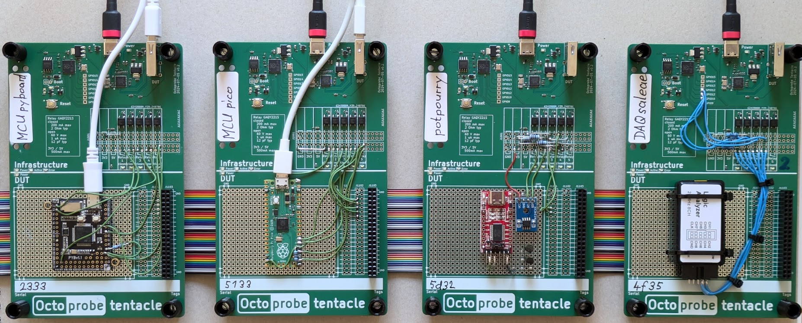
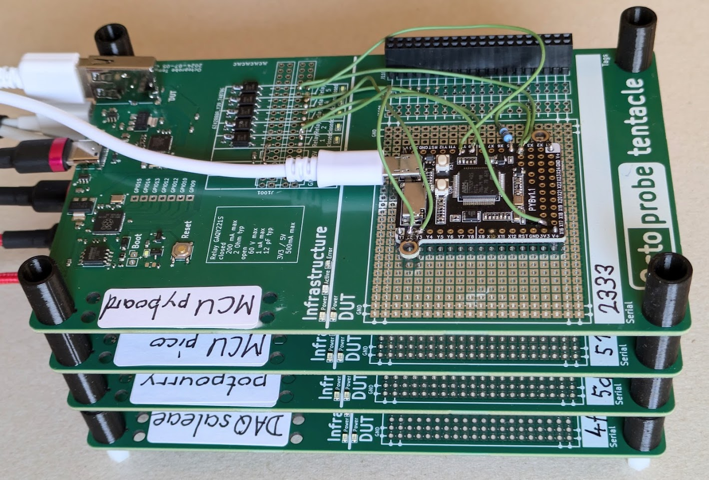
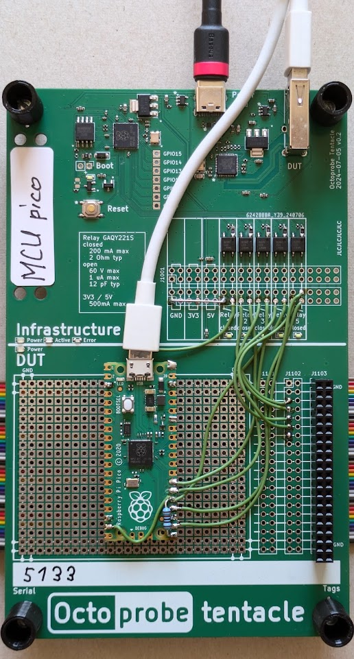

Octoprobe entry page
====================

`Octoprobe`_

.. _Octoprobe: https://raw.githubusercontent.com/hmaerki/experiment_microoctopus/main/branding/octoprobe/octoprobe_logo_v3_inkscape.png

HIL (Hardware in the Loop) testinfrastructure
---------------------------------------------

`Presentation at MicroPython Meetup Melbourne <README_images/2024-07-27_melbourne_micropython_meetup.pdf>`_

Terms
-----

See :doc:`Terms </design/terms>`

Goal
----

* `octoprobe` allows to automatically test various micropython boards against various gadgets.
* Tests should run automatically and include firmware update.
* Tests should be triggered from the github workflow, for example on commits or pull requests.

octoprobe testenvironment
-------------------------

* Software
  
  * dockerized on linux
  * Test script: `pytest`
  * github runner

* Hardware
  
  * A tentacle may be ordered assembled at JLCPCB and will cost below USD50.
  * Every tentacle is equipped by a RP2040 which controls the DUT.
  * The Inkbus connects the tentacles. Typically exactly one BoardTentacle and one GadgetTentacle is connected to the Inkbus.
* Extended Hardware
  
  * octoprobe may also have specialized tentacles like a scope tentacle.
  * octoprobe may also control cams to read displays, wlan hotspot, etc.
  
* Firmware under test

  * Must be provided by the tester

* Test software

  * octoprobe provides basic functionality like updating firmware, connecting the inkbus, tentacle inventory.
  * However the pytest code itselve is provided by the tester together with the firmware.

Tentacles / testbed_showcase
----------------------------

Kicad schmatics/pcb may be found `herex`_.

.. _herex: https://github.com/octoprobe/tentacle

A *testbed* describes how test using a set of tentacles.

*testbed_showcase* is described here `here`_ and allows to test i2c, uart, onewire and timers.

.. _here: https://github.com/octoprobe/testbed_showcase/blob/main/doc/README.md

**4 tentacles - ribbon cable**

**4 tentacles - stacked**

**MCU tentacle**

Test flow
---------

In this test the OLED display shall be tested agains PYBv1.1 and ESP32 using firmware v9.12.

.. mermaid::

   sequenceDiagram
      participant github
      participant U as octoprobe
      participant TP as Tentacle PYBv1.1
      participant TE as Tentacle ESP32
      participant TO as Tentacle OLED
      participant I as Inkbus
      github->>U: send firmware v9.12 and testcode

      Note over U,TO: Test PYBv1.1 vs OLED

      U->>+TP: update firmware
      TP->>+I: connect to inkbus
      TO->>+I: connect to inkbus
      U->>+TP: run pytest
      TP-->>-U: collect results
      I-->>-TP: disconnect inkbus
      I-->>-TO: disconnect inkbus

      Note over U,TO: Test ESP32 vs OLED

      U->>+TE: update firmware
      TE->>+I: connect to inkbus
      TO->>+I: connect to inkbus
      U->>+TE: run pytest
      TE-->>-U: collect results
      I-->>-TE: disconnect inkbus
      I-->>-TO: disconnect inkbus

      U-->>github: testresults

